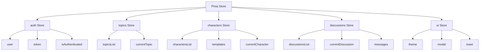

# simFocus 前端设计文档

**项目名称**: simFocus - AI 虚拟焦点小组平台
**文档版本**: v1.0
**创建日期**: 2026-02-03
**文档作者**: Frontend Team

---

## 目录

1. [项目概述](#1-项目概述)
2. [技术栈](#2-技术栈)
3. [项目架构](#3-项目架构)
4. [目录结构](#4-目录结构)
5. [核心模块设计](#5-核心模块设计)
6. [状态管理](#6-状态管理)
7. [路由设计](#7-路由设计)
8. [API 集成](#8-api-集成)
9. [认证系统](#9-认证系统)
10. [UI/UX 设计](#10-uiux-设计)
11. [组件设计](#11-组件设计)
12. [WebSocket 实时通信](#12-websocket-实时通信)
13. [构建和部署](#13-构建和部署)
14. [性能优化](#14-性能优化)
15. [安全考虑](#15-安全考虑)
16. [开发指南](#16-开发指南)
17. [测试策略](#17-测试策略)

---

## 1. 项目概述

### 1.1 产品定位

simFocus 是一个基于 AI 的虚拟焦点小组平台，用户可以通过创建多个虚拟角色进行实时讨论，获得多元化的观点和洞察。前端应用是用户与平台交互的主要界面。

### 1.2 核心功能

- **用户认证**: 支持本地认证和 Keycloak SSO 单点登录
- **议题管理**: 创建、查看、编辑讨论议题
- **角色系统**: 管理和配置 AI 讨论角色
- **讨论引擎**: 实时观察多角色讨论过程
- **报告生成**: 查看和导出讨论报告
- **API 管理**: 配置 LLM API 密钥

### 1.3 设计原则

- **简洁优先**: 界面简洁直观，减少用户学习成本
- **响应式设计**: 支持桌面和移动设备
- **性能优先**: 快速加载和响应
- **可访问性**: 遵循 WCAG 2.1 AA 标准
- **渐进增强**: 基础功能在所有浏览器可用

---

## 2. 技术栈

### 2.1 核心框架

| 技术 | 版本 | 用途 |
|------|------|------|
| **Vue 3** | 3.4.0 | 渐进式 JavaScript 框架 |
| **Vite** | 5.0.10 | 构建工具和开发服务器 |
| **Vue Router** | 4.2.5 | 官方路由管理器 |
| **Pinia** | 2.1.7 | 状态管理库 |

### 2.2 HTTP 客户端与通信

| 技术 | 版本 | 用途 |
|------|------|------|
| **Axios** | 1.6.5 | HTTP 客户端 |
| **Socket.IO Client** | 4.6.0 | WebSocket 实时通信 |

### 2.3 UI 和样式

| 技术 | 版本 | 用途 |
|------|------|------|
| **Tailwind CSS** | 3.4.0 | 原子化 CSS 框架 |
| **PostCSS** | 10.4.16 | CSS 处理器 |
| **Autoprefixer** | 10.4.16 | CSS 自动添加前缀 |
| **Heroicons** | 2.1.1 | SVG 图标库 |
| **Marked** | 17.0.1 | Markdown 解析器 |

### 2.4 认证与安全

| 技术 | 版本 | 用途 |
|------|------|------|
| **Keycloak-js** | 24.0.0 | OIDC 认证客户端 |

### 2.5 开发工具

| 技术 | 版本 | 用途 |
|------|------|------|
| **@vitejs/plugin-vue** | 5.0.2 | Vue 3 Vite 插件 |
| **Node.js** | 20-alpine | 运行时环境 |
| **Docker** | - | 容器化部署 |
| **Nginx** | - | 反向代理 |

### 2.6 技术选型理由

#### Vue 3 + Composition API

- **更小的包体积**: 比 React 更小的运行时
- **TypeScript 支持**: 内置类型推断
- **组合式 API**: 更好的逻辑复用和代码组织
- **响应式系统**: 细粒度响应式，性能优秀

#### Vite

- **快速开发**: 原生 ESM 支持，瞬间 HMR
- **优化构建**: 使用 Rollup 进行优化打包
- **开箱即用**: 无需复杂配置

#### Tailwind CSS

- **原子化设计**: 快速构建界面
- **按需生成**: 自动清除未使用的样式
- **一致性**: 统一的设计系统
- **定制性强**: 易于扩展主题

#### Pinia

- **TypeScript 友好**: 完整的类型推断
- **轻量级**: 比 Vuex 更小更简单
- **Devtools 支持**: 优秀的开发体验

---

## 3. 项目架构

### 3.1 整体架构

```
┌─────────────────────────────────────────────────────────────┐
│                        用户界面层                            │
│  ┌─────────────────────────────────────────────────────┐   │
│  │              页面组件 (Views)                        │   │
│  │  Home | Topics | Characters | Discussions | Settings │   │
│  └─────────────────────────────────────────────────────┘   │
│  ┌─────────────────────────────────────────────────────┐   │
│  │              可复用组件 (Components)                 │   │
│  │  Modal | Toast | Form Elements | Chat Interface    │   │
│  └─────────────────────────────────────────────────────┘   │
└─────────────────────────────────────────────────────────────┘
                              │
                              ▼
┌─────────────────────────────────────────────────────────────┐
│                       业务逻辑层                             │
│  ┌──────────────────┐  ┌──────────────────┐                │
│  │   路由管理        │  │   状态管理        │                │
│  │  (Vue Router)    │  │   (Pinia)        │                │
│  └──────────────────┘  └──────────────────┘                │
│  ┌─────────────────────────────────────────────────────┐   │
│  │              组合式函数 (Composables)                │   │
│  │           useModal | useAuth | useSocket            │   │
│  └─────────────────────────────────────────────────────┘   │
└─────────────────────────────────────────────────────────────┘
                              │
                              ▼
┌─────────────────────────────────────────────────────────────┐
│                       服务层                                 │
│  ┌──────────────────┐  ┌──────────────────┐                │
│  │   API 服务       │  │  Keycloak 服务   │                │
│  │   (Axios)        │  │  (OIDC)          │                │
│  └──────────────────┘  └──────────────────┘                │
│  ┌──────────────────┐  ┌──────────────────┐                │
│  │  WebSocket 服务  │  │  端点配置        │                │
│  │  (Socket.IO)     │  │  (Endpoints)     │                │
│  └──────────────────┘  └──────────────────┘                │
└─────────────────────────────────────────────────────────────┘
                              │
                              ▼
┌─────────────────────────────────────────────────────────────┐
│                       后端 API                               │
│              REST API + WebSocket (FastAPI)                  │
└─────────────────────────────────────────────────────────────┘
```

### 3.2 应用生命周期

```
1. 应用初始化 (main.js)
   ↓
2. 创建 Vue 应用实例
   ↓
3. 安装插件 (Pinia, Router)
   ↓
4. 挂载根组件 (App.vue)
   ↓
5. 路由导航守卫检查认证
   ↓
6. 渲染页面组件
   ↓
7. 组件挂载，获取初始数据
   ↓
8. 用户交互，状态更新
```

---

## 4. 目录结构

```
frontend/
├── public/                     # 静态资源（未被 Vite 处理）
├── src/
│   ├── assets/                # 资源文件
│   │   └── styles/
│   │       └── main.css       # 全局样式
│   ├── components/            # 可复用组件
│   │   ├── CommonModal.vue    # 通用模态框
│   │   ├── GlobalModal.vue    # 全局模态框管理器
│   │   └── Toast.vue          # 提示组件
│   ├── composables/           # 组合式函数
│   │   └── useModal.js        # 模态框状态管理
│   ├── config/                # 配置文件
│   │   └── keycloak.js        # Keycloak 配置
│   ├── services/              # 服务层
│   │   ├── api.js             # Axios 实例配置
│   │   ├── endpoints.js       # API 端点定义
│   │   └── keycloak.js        # Keycloak 服务
│   ├── stores/                # Pinia 状态管理
│   │   └── auth.js            # 认证状态
│   ├── views/                 # 页面组件
│   │   ├── Home.vue           # 首页
│   │   ├── Login.vue          # 登录页
│   │   ├── Register.vue       # 注册页
│   │   ├── AuthCallback.vue   # Keycloak 回调
│   │   ├── AuthSuccess.vue    # 认证成功
│   │   ├── Topics.vue         # 议题列表
│   │   ├── NewTopic.vue       # 创建议题
│   │   ├── TopicDetail.vue    # 议题详情
│   │   ├── Characters.vue     # 角色列表
│   │   ├── NewCharacter.vue   # 创建角色
│   │   ├── CharacterDetail.vue # 角色详情
│   │   ├── Discussions.vue    # 讨论列表
│   │   ├── NewDiscussion.vue  # 创建讨论
│   │   ├── DiscussionDetail.vue # 讨论详情
│   │   ├── DiscussionReport.vue # 讨论报告
│   │   └── Settings.vue       # 设置页面
│   ├── App.vue                # 根组件
│   ├── main.js                # 应用入口
│   └── router.js              # 路由配置
├── .env                       # 环境变量
├── Dockerfile                 # Docker 配置
├── index.html                 # HTML 模板
├── package.json               # 依赖管理
├── postcss.config.js          # PostCSS 配置
├── tailwind.config.js         # Tailwind 配置
└── vite.config.js             # Vite 配置
```

### 4.1 文件命名规范

| 类型 | 命名规范 | 示例 |
|------|----------|------|
| 页面组件 | PascalCase | `Topics.vue`, `NewTopic.vue` |
| 可复用组件 | PascalCase | `CommonModal.vue`, `Toast.vue` |
| 组合式函数 | camelCase with `use` prefix | `useModal.js`, `useAuth.js` |
| 服务 | camelCase | `api.js`, `keycloak.js` |
| Store | camelCase | `auth.js` |
| 配置 | camelCase | `keycloak.js` |

---

## 5. 核心模块设计

### 5.1 认证模块 (Auth Module)

#### 5.1.1 双认证模式支持

系统支持两种认证模式，通过环境变量 `VITE_AUTH_MODE` 配置：

**1. 本地认证模式 (local)**
- 传统的邮箱/密码注册登录
- JWT Token 认证
- 后端直接验证用户凭据

**2. Keycloak SSO 模式 (keycloak)**
- 支持 `backend-proxy` 和 `frontend-direct` 两种子模式
- OIDC 标准认证流程
- 单点登录和单点登出

#### 5.1.2 认证流程

**本地认证流程**:
```
用户输入邮箱/密码
    ↓
前端调用 POST /api/auth/login
    ↓
后端验证凭据，返回 JWT Token
    ↓
前端存储 Token 到 localStorage
    ↓
设置 Axios Authorization Header
    ↓
跳转到首页
```

**Keycloak 后端代理模式流程**:
```
用户点击 SSO 登录
    ↓
前端重定向到 /api/auth/keycloak/login
    ↓
后端重定向到 Keycloak 登录页
    ↓
用户在 Keycloak 完成认证
    ↓
Keycloak 回调到 /api/auth/keycloak/callback
    ↓
后端处理 Token，创建/更新用户
    ↓
后端重定向到前端 /auth/success?token={jwt}
    ↓
前端存储 Token，完成登录
```

**Keycloak 前端直接模式流程**:
```
用户点击 SSO 登录
    ↓
前端初始化 Keycloak-js
    ↓
调用 keycloak.login()
    ↓
重定向到 Keycloak 登录页
    ↓
Keycloak 回调到 /auth/callback
    ↓
前端将 Token 发送到后端验证
    ↓
后端验证并返回 JWT Token
    ↓
完成登录
```

#### 5.1.3 Token 管理

```javascript
// Token 存储位置
localStorage.setItem('token', jwtToken)
localStorage.setItem('auth_provider', 'local' | 'keycloak')

// Token 自动添加到请求
axios.interceptors.request.use(config => {
  const token = localStorage.getItem('token')
  if (token) {
    config.headers.Authorization = `Bearer ${token}`
  }
  return config
})

// Token 失效处理
axios.interceptors.response.use(
  response => response,
  error => {
    if (error.response?.status === 401) {
      localStorage.removeItem('token')
      window.location.href = '/login'
    }
    return Promise.reject(error)
  }
)
```

### 5.2 议题管理模块 (Topics Module)

#### 5.2.1 功能范围

- 议题列表查看
- 创建新议题
- 查看议题详情
- 编辑议题
- 删除议题
- 议题搜索和过滤

#### 5.2.2 数据结构

```typescript
interface Topic {
  id: string
  user_id: string
  title: string
  description: string
  context?: string
  attachments?: Array<{
    name: string
    url: string
    type: string
    size: number
  }>
  status: 'draft' | 'ready' | 'in_discussion' | 'completed'
  created_at: string
  updated_at: string
}
```

#### 5.2.3 页面设计

**Topics.vue (议题列表)**
- 网格/列表视图切换
- 搜索和过滤
- 状态标签
- 快速操作按钮
- 分页加载

**NewTopic.vue (创建议题)**
- 标题输入（10-200字符）
- 描述编辑器（支持富文本）
- 背景信息添加
- 附件上传
- 保存草稿功能

### 5.3 角色系统模块 (Characters Module)

#### 5.3.1 功能范围

- 查看角色模板库
- 创建自定义角色
- 管理我的角色
- 角色详情查看
- 角色编辑和删除
- 智能角色推荐

#### 5.3.2 数据结构

```typescript
interface Character {
  id: string
  user_id: string | null
  name: string
  avatar_url: string
  is_template: boolean
  is_public: boolean
  config: {
    age: number
    gender: string
    profession: string
    personality: {
      openness: number      // 1-10
      rigor: number         // 1-10
      critical_thinking: number // 1-10
      optimism: number      // 1-10
    }
    knowledge: {
      fields: string[]
      experience_years: number
      representative_views: string[]
    }
    stance: 'support' | 'oppose' | 'neutral' | 'critical_exploration'
    expression_style: 'formal' | 'casual' | 'technical' | 'storytelling'
    behavior_pattern: 'active' | 'passive' | 'balanced'
  }
  usage_count: number
  rating_avg: number
  rating_count: number
  created_at: string
  updated_at: string
}
```

#### 5.3.3 角色配置界面

**NewCharacter.vue (创建角色)**
- 基本信息：姓名、头像、职业
- 性格特征：滑动条调节（1-10分）
- 知识背景：多选标签
- 讨论立场：单选
- 表达风格：单选
- 行为模式：单选
- 预览功能

### 5.4 讨论引擎模块 (Discussions Module)

#### 5.4.1 功能范围

- 创建讨论（选择议题和角色）
- 实时观察讨论过程
- 讨论控制（暂停、继续、插入问题）
- 查看讨论历史
- 查看讨论报告

#### 5.4.2 讨论界面设计

**DiscussionDetail.vue (讨论详情)**

```
┌────────────────────────────────────────────────────────┐
│  讨论标题: XXX                              [结束讨论]  │
├────────────────────────────────────────────────────────┤
│  ┌────────────┐  ┌──────────────────────────────────┐  │
│  │            │  │  讨论区域                        │  │
│  │  角色列表  │  │  ┌────────────────────────────┐  │  │
│  │            │  │  │ [角色A] 10:30              │  │  │
│  │  角色A ✓   │  │  │ 消息内容...               │  │  │
│  │  角色B     │  │  └────────────────────────────┘  │  │
│  │  角色C     │  │  ┌────────────────────────────┐  │  │
│  │  角色D     │  │  │ [角色B] 10:31              │  │  │
│  │            │  │  │ 消息内容...               │  │  │
│  │            │  │  └────────────────────────────┘  │  │
│  └────────────┘  │                                  │  │
│                  │  (自动滚动到最新消息)              │  │
│  ┌────────────┐  └──────────────────────────────────┘  │
│  │ 控制面板   │                                        │
│  │ [暂停]     │  ┌──────────────────────────────────┐  │
│  │ [继续]     │  │ 插入问题:                        │  │
│  │ [插入问题] │  │ [__________________] [发送]      │  │
│  └────────────┘  └──────────────────────────────────┘  │
└────────────────────────────────────────────────────────┘
```

#### 5.4.3 讨论状态

```typescript
interface Discussion {
  id: string
  topic_id: string
  user_id: string
  discussion_mode: 'free' | 'structured' | 'creative' | 'consensus'
  max_rounds: number
  status: 'initialized' | 'running' | 'paused' | 'completed' | 'failed' | 'cancelled'
  current_round: number
  current_phase: 'opening' | 'development' | 'debate' | 'closing'
  participants: Array<{
    character_id: string
    character_name: string
    avatar_url: string
    message_count: number
  }>
  created_at: string
  started_at: string | null
  completed_at: string | null
}
```

### 5.5 报告生成模块 (Reports Module)

#### 5.5.1 功能范围

- 自动生成结构化报告
- 报告可视化（图表）
- 报告导出（PDF、Markdown、JSON）
- 报告分享

#### 5.5.2 报告结构

```typescript
interface DiscussionReport {
  id: string
  discussion_id: string
  overview: {
    topic_title: string
    participant_count: number
    duration_minutes: number
    total_rounds: number
    created_at: string
  }
  viewpoints_summary: Array<{
    character_name: string
    core_arguments: string[]
    stance_evolution?: string
  }>
  consensus: {
    agreed_points: string[]
    recommendations: string[]
  }
  controversies: Array<{
    topic: string
    opposing_views: Array<{
      character: string
      argument: string
    }>
  }>
  insights: {
    key_findings: string[]
    action_items: string[]
    risks: string[]
  }
  quality_scores: {
    depth: number
    diversity: number
    constructive: number
    coherence: number
  }
}
```

#### 5.5.3 报告可视化

- **观点分布图**: 雷达图展示角色多维特征
- **争议热力图**: 显示争议点讨论热度
- **立场演变图**: 折线图或桑基图
- **关键词云**: 提取高频关键词

### 5.6 设置模块 (Settings Module)

#### 5.6.1 功能范围

- 个人信息编辑
- API 密钥管理
- 偏好设置
- 账户删除

#### 5.6.2 API 密钥管理

```typescript
interface APIKey {
  id: string
  user_id: string
  provider: 'openai' | 'anthropic' | 'custom'
  key_name: string
  api_base_url?: string
  default_model: string
  is_active: boolean
  created_at: string
  last_used_at: string | null
}
```

**API 密钥管理界面**:
- 密钥列表（已脱敏显示）
- 添加新密钥
- 编辑密钥
- 删除密钥
- 设置默认密钥
- 使用统计

---

## 6. 状态管理

### 6.1 Pinia Store 架构



### 6.2 auth Store

```javascript
// src/stores/auth.js
export const useAuthStore = defineStore('auth', () => {
  // State
  const user = ref(null)
  const token = ref(localStorage.getItem('token') || null)
  const authProvider = ref(localStorage.getItem('auth_provider') || 'local')

  // Getters
  const isAuthenticated = computed(() => !!token.value && !!user.value)

  // Actions
  const login = async (credentials) => { /* ... */ }
  const loginWithKeycloak = async () => { /* ... */ }
  const handleKeycloakCallback = async (token) => { /* ... */ }
  const register = async (userData) => { /* ... */ }
  const logout = async () => { /* ... */ }
  const fetchUser = async () => { /* ... */ }
  const updateUser = async (userData) => { /* ... */ }

  return {
    user,
    token,
    authProvider,
    isAuthenticated,
    login,
    loginWithKeycloak,
    handleKeycloakCallback,
    register,
    logout,
    fetchUser,
    updateUser
  }
})
```

### 6.3 持久化策略

**localStorage 存储**:
- `token`: JWT 访问令牌
- `auth_provider`: 认证提供者标识

**sessionStorage 存储** (可选):
- 临时状态
- 表单草稿

**内存状态**:
- 组件本地状态
- 未保存的表单数据

---

## 7. 路由设计

### 7.1 路由表

| 路径 | 名称 | 组件 | 需要认证 | 描述 |
|------|------|------|----------|------|
| `/` | Home | Home.vue | 否 | 首页 |
| `/login` | Login | Login.vue | 否 | 登录页 |
| `/register` | Register | Register.vue | 否 | 注册页 |
| `/auth/callback` | AuthCallback | AuthCallback.vue | 否 | Keycloak 回调 |
| `/auth/success` | AuthSuccess | AuthSuccess.vue | 否 | 认证成功 |
| `/topics` | Topics | Topics.vue | 是 | 议题列表 |
| `/topics/new` | NewTopic | NewTopic.vue | 是 | 创建议题 |
| `/topics/:id` | TopicDetail | TopicDetail.vue | 是 | 议题详情 |
| `/characters` | Characters | Characters.vue | 是 | 角色列表 |
| `/characters/new` | NewCharacter | NewCharacter.vue | 是 | 创建角色 |
| `/characters/:id` | CharacterDetail | CharacterDetail.vue | 是 | 角色详情 |
| `/discussions` | Discussions | Discussions.vue | 是 | 讨论列表 |
| `/discussions/new` | NewDiscussion | NewDiscussion.vue | 是 | 创建讨论 |
| `/discussions/:id` | DiscussionDetail | DiscussionDetail.vue | 是 | 讨论详情 |
| `/discussions/:id/report` | DiscussionReport | DiscussionReport.vue | 是 | 讨论报告 |
| `/settings` | Settings | Settings.vue | 是 | 设置 |

### 7.2 路由守卫

```javascript
// 全局前置守卫
router.beforeEach((to, from, next) => {
  const authStore = useAuthStore()
  const requiresAuth = to.meta.requiresAuth

  if (requiresAuth && !authStore.isAuthenticated) {
    // 未登录访问需要认证的页面
    next('/login')
  } else if ((to.name === 'Login' || to.name === 'Register') && authStore.isAuthenticated) {
    // 已登录访问登录/注册页面
    next('/topics')
  } else {
    // 正常导航
    next()
  }
})
```

### 7.3 路由懒加载

所有页面组件使用动态导入进行代码分割：

```javascript
{
  path: '/topics',
  name: 'Topics',
  component: () => import('@/views/Topics.vue'),
  meta: { requiresAuth: true }
}
```

### 7.4 导航类型

**声明式导航**:
```vue
<router-link to="/topics">议题</router-link>
```

**编程式导航**:
```javascript
router.push('/topics')
router.push({ name: 'TopicDetail', params: { id: topicId } })
router.replace('/login')
```

---

## 8. API 集成

### 8.1 Axios 配置

```javascript
// src/services/api.js
import axios from 'axios'

const api = axios.create({
  baseURL: '/api',
  timeout: 30000,
  headers: {
    'Content-Type': 'application/json'
  }
})
```

### 8.2 请求拦截器

```javascript
api.interceptors.request.use(
  (config) => {
    const token = localStorage.getItem('token')
    if (token) {
      config.headers.Authorization = `Bearer ${token}`
    }
    return config
  },
  (error) => Promise.reject(error)
)
```

### 8.3 响应拦截器

```javascript
api.interceptors.response.use(
  (response) => response,
  (error) => {
    if (error.response) {
      const { status, data } = error.response

      if (status === 401 || status === 403) {
        localStorage.removeItem('token')
        window.location.href = '/login'
      }

      return Promise.reject({
        status,
        message: data?.error?.message || data?.detail || '请求失败',
        code: data?.error?.code || 'UNKNOWN_ERROR'
      })
    } else if (error.request) {
      return Promise.reject({
        status: 0,
        message: '网络错误，请检查连接',
        code: 'NETWORK_ERROR'
      })
    } else {
      return Promise.reject({
        status: 0,
        message: '请求配置错误',
        code: 'REQUEST_ERROR'
      })
    }
  }
)
```

### 8.4 API 端点定义

```javascript
// src/services/endpoints.js
export default {
  // Auth
  auth: {
    login: (data) => api.post('/auth/login', data),
    register: (data) => api.post('/auth/register', data),
    logout: () => api.post('/auth/logout'),
    getMe: () => api.get('/auth/me')
  },

  // Topics
  topics: {
    getAll: (params) => api.get('/topics', { params }),
    create: (data) => api.post('/topics', data),
    getById: (id) => api.get(`/topics/${id}`),
    update: (id, data) => api.patch(`/topics/${id}`, data),
    delete: (id) => api.delete(`/topics/${id}`)
  },

  // Characters
  characters: {
    getTemplates: (params) => api.get('/characters/templates', { params }),
    getMine: (params) => api.get('/characters', { params }),
    create: (data) => api.post('/characters', data),
    update: (id, data) => api.patch(`/characters/${id}`, data),
    delete: (id) => api.delete(`/characters/${id}`)
  },

  // Discussions
  discussions: {
    getAll: (params) => api.get('/discussions', { params }),
    create: (data) => api.post('/discussions', data),
    getById: (id) => api.get(`/discussions/${id}`),
    start: (id, provider) => api.post(`/discussions/${id}/start`, null, { params: { provider } }),
    pause: (id) => api.post(`/discussions/${id}/pause`),
    resume: (id) => api.post(`/discussions/${id}/resume`),
    stop: (id) => api.post(`/discussions/${id}/stop`),
    injectQuestion: (id, question) => api.post(`/discussions/${id}/inject-question`, { question })
  }
}
```

### 8.5 代理配置

**开发环境** (vite.config.js):
```javascript
server: {
  proxy: {
    '/api': {
      target: 'http://backend:8000',
      changeOrigin: true
    },
    '/ws': {
      target: 'ws://backend:8000',
      ws: true
    }
  }
}
```

**生产环境** (Nginx):
```nginx
location /api {
    proxy_pass http://backend:8000;
    proxy_set_header Host $host;
    proxy_set_header X-Real-IP $remote_addr;
}

location /ws {
    proxy_pass http://backend:8000;
    proxy_http_version 1.1;
    proxy_set_header Upgrade $http_upgrade;
    proxy_set_header Connection "upgrade";
}
```

---

## 9. 认证系统

### 9.1 认证架构

```
┌─────────────────────────────────────────────────────────────┐
│                        认证层                                │
│  ┌─────────────────────────────────────────────────────┐   │
│  │              useAuthStore (Pinia)                   │   │
│  │   - user                                            │   │
│  │   - token                                           │   │
│  │   - authProvider                                   │   │
│  │   - isAuthenticated                                │   │
│  └─────────────────────────────────────────────────────┘   │
│                              │                               │
│          ┌───────────────────┴───────────────────┐          │
│          ▼                                       ▼          │
│  ┌───────────────────┐               ┌───────────────────┐  │
│  │  Local Auth       │               │  Keycloak SSO     │  │
│  │  Service          │               │  Service          │  │
│  └───────────────────┘               └───────────────────┘  │
│          │                                       │          │
│          ▼                                       ▼          │
│  ┌───────────────────┐               ┌───────────────────┐  │
│  │  /api/auth/login  │               │  OIDC Flow        │  │
│  └───────────────────┘               └───────────────────┘  │
└─────────────────────────────────────────────────────────────┘
```

### 9.2 Keycloak 配置

**环境变量** (.env):
```bash
VITE_KEYCLOAK_ENABLED=true
VITE_KEYCLOAK_SERVER_URL=https://keycloak.plfai.cn/
VITE_KEYCLOAK_REALM=simfocus
VITE_KEYCLOAK_CLIENT_ID=simfocus-frontend
VITE_AUTH_MODE=backend-proxy
```

**配置文件** (src/config/keycloak.js):
```javascript
export const keycloakConfig = {
  url: import.meta.env.VITE_KEYCLOAK_SERVER_URL,
  realm: import.meta.env.VITE_KEYCLOAK_REALM,
  clientId: import.meta.env.VITE_KEYCLOAK_CLIENT_ID,
  sslRequired: 'external',
  flow: 'standard',
  redirectUri: window.location.origin + '/auth/callback',
  onLoad: 'login-required',
  scope: 'openid profile email',
  tokenRefreshInterval: 30
}
```

### 9.3 认证流程图

#### 本地认证流程

```
┌─────────┐     ┌─────────┐     ┌─────────┐     ┌─────────┐
│  用户   │────>│  前端   │────>│  后端   │────>│ 数据库  │
└─────────┘     └─────────┘     └─────────┘     └─────────┘
    │               │               │               │
    │ 1. 输入凭据    │               │               │
    │               │ 2. POST /auth/login          │
    │               │               │ 3. 验证凭据    │
    │               │               │               │ 4. 查询用户
    │               │               │               │
    │               │ 5. 返回 JWT Token            │
    │ 6. 存储 Token  │               │               │
    │               │               │               │
    │ 7. 跳转首页    │               │               │
```

#### Keycloak 认证流程

```
┌─────────┐     ┌─────────┐     ┌─────────┐     ┌──────────┐
│  用户   │────>│  前端   │────>│  后端   │────>│ Keycloak │
└─────────┘     └─────────┘     └─────────┘     └──────────┘
    │               │               │                 │
    │ 1. 点击 SSO   │               │                 │
    │               │ 2. 重定向到后端登录              │
    │               │               │ 3. 重定向到 KC  │
    │               │               │                 │ 4. 显示登录页
    │ 5. 输入凭据                                   │
    │                                                 │
    │ 6. KC 回调后端                                 │
    │               │               │ 7. 交换 Token   │
    │               │               │ 8. 创建/更新用户│
    │               │ 9. 重定向带 Token              │
    │ 10. 存储 Token                                  │
    │               │               │                 │
    │ 11. 跳转首页   │               │                 │
```

### 9.4 认证服务类

```javascript
// src/services/keycloak.js
class KeycloakService {
  constructor() {
    this.keycloak = null
    this.authMode = 'backend-proxy'
    this.isAuthenticated = false
    this.token = null
  }

  async init() {
    // 初始化 Keycloak
  }

  login() {
    if (this.authMode === 'frontend-direct') {
      this.loginFrontendDirect()
    } else {
      this.loginBackendProxy()
    }
  }

  async logout() {
    // 登出逻辑
  }

  async updateToken(minValidity = 5) {
    // Token 刷新
  }
}
```

---

## 10. UI/UX 设计

### 10.1 设计系统

#### 色彩系统

**Primary 色系** (蓝色系):
```css
--primary-50:  #f0f9ff
--primary-100: #e0f2fe
--primary-200: #bae6fd
--primary-300: #7dd3fc
--primary-400: #38bdf8
--primary-500: #0ea5e9  /* 主色 */
--primary-600: #0284c7
--primary-700: #0369a1
--primary-800: #075985
--primary-900: #0c4a6e
```

**Neutral 色系**:
```css
--gray-50:   #f9fafb
--gray-100:  #f3f4f6
--gray-200:  #e5e7eb
--gray-300:  #d1d5db
--gray-400:  #9ca3af
--gray-500:  #6b7280
--gray-600:  #4b5563
--gray-700:  #374151
--gray-800:  #1f2937
--gray-900:  #111827
```

**功能色**:
```css
--success: #10b981  /* 绿色 */
--warning: #f59e0b  /* 橙色 */
--error:   #ef4444  /* 红色 */
--info:    #3b82f6  /* 蓝色 */
```

#### 字体系统

```css
font-family: system-ui, -apple-system, BlinkMacSystemFont, 'Segoe UI', Roboto,
             'Helvetica Neue', Arial, sans-serif;

/* 字体大小 */
text-xs:   0.75rem    /* 12px */
text-sm:   0.875rem   /* 14px */
text-base: 1rem       /* 16px */
text-lg:   1.125rem   /* 18px */
text-xl:   1.25rem    /* 20px */
text-2xl:  1.5rem     /* 24px */
text-3xl:  1.875rem   /* 30px */
text-4xl:  2.25rem    /* 36px */
text-5xl:  3rem       /* 48px */
```

#### 间距系统

```css
/* Tailwind 间距单位 */
0:     0
1:     0.25rem  /* 4px */
2:     0.5rem   /* 8px */
3:     0.75rem  /* 12px */
4:     1rem     /* 16px */
5:     1.25rem  /* 20px */
6:     1.5rem   /* 24px */
8:     2rem     /* 32px */
10:    2.5rem   /* 40px */
12:    3rem     /* 48px */
16:    4rem     /* 64px */
```

#### 圆角系统

```css
rounded-none: 0
rounded-sm:   0.125rem  /* 2px */
rounded:      0.25rem   /* 4px */
rounded-md:   0.375rem  /* 6px */
rounded-lg:   0.5rem    /* 8px */
rounded-xl:   0.75rem   /* 12px */
rounded-2xl:  1rem      /* 16px */
rounded-full: 9999px
```

#### 阴影系统

```css
shadow-sm:  0 1px 2px 0 rgb(0 0 0 / 0.05)
shadow:     0 1px 3px 0 rgb(0 0 0 / 0.1), 0 1px 2px -1px rgb(0 0 0 / 0.1)
shadow-md:  0 4px 6px -1px rgb(0 0 0 / 0.1), 0 2px 4px -2px rgb(0 0 0 / 0.1)
shadow-lg:  0 10px 15px -3px rgb(0 0 0 / 0.1), 0 4px 6px -4px rgb(0 0 0 / 0.1)
shadow-xl:  0 20px 25px -5px rgb(0 0 0 / 0.1), 0 8px 10px -6px rgb(0 0 0 / 0.1)
```

### 10.2 响应式断点

```css
/* Tailwind 默认断点 */
sm:  640px   /* 小屏幕 */
md:  768px   /* 平板 */
lg:  1024px  /* 桌面 */
xl:  1280px  /* 大桌面 */
2xl: 1536px  /* 超大屏 */
```

### 10.3 组件样式规范

#### 按钮组件

```html
<!-- 主要按钮 -->
<button class="bg-primary-600 text-white px-4 py-2 rounded-md hover:bg-primary-700">
  主要操作
</button>

<!-- 次要按钮 -->
<button class="bg-white text-gray-700 border border-gray-300 px-4 py-2 rounded-md hover:bg-gray-50">
  次要操作
</button>

<!-- 危险按钮 -->
<button class="bg-red-600 text-white px-4 py-2 rounded-md hover:bg-red-700">
  删除
</button>
```

#### 表单组件

```html
<!-- 输入框 -->
<input
  type="text"
  class="w-full px-3 py-2 border border-gray-300 rounded-md focus:outline-none focus:ring-2 focus:ring-primary-500"
  placeholder="请输入..."
/>

<!-- 选择框 -->
<select class="w-full px-3 py-2 border border-gray-300 rounded-md">
  <option>选项 1</option>
  <option>选项 2</option>
</select>
```

#### 卡片组件

```html
<div class="bg-white rounded-lg shadow-sm p-6">
  <h3 class="text-lg font-semibold mb-2">标题</h3>
  <p class="text-gray-600">内容...</p>
</div>
```

### 10.4 动画效果

```css
/* 淡入动画 */
@keyframes fadeIn {
  from {
    opacity: 0;
    transform: translateY(10px);
  }
  to {
    opacity: 1;
    transform: translateY(0);
  }
}

.chat-message {
  animation: fadeIn 0.3s ease-in;
}

/* 加载动画 */
@keyframes spin {
  0% { transform: rotate(0deg); }
  100% { transform: rotate(360deg); }
}

.spinner {
  border: 3px solid #f3f3f3;
  border-top: 3px solid #3498db;
  border-radius: 50%;
  width: 24px;
  height: 24px;
  animation: spin 1s linear infinite;
}
```

---

## 11. 组件设计

### 11.1 全局组件

#### GlobalModal.vue

全局模态框管理器，用于管理应用中的所有模态框。

```javascript
// 使用示例
import { useModal } from '@/composables/useModal'

const { openModal, closeModal } = useModal()

// 打开模态框
openModal({
  title: '确认删除',
  content: '此操作无法撤销，确定要删除吗？',
  onConfirm: () => {
    // 确认回调
  }
})
```

#### Toast.vue

消息提示组件。

```javascript
// 使用示例
import { useToast } from '@/composables/useToast'

const toast = useToast()

toast.success('操作成功')
toast.error('操作失败')
toast.warning('请注意')
toast.info('提示信息')
```

### 11.2 业务组件

#### TopicCard.vue

议题卡片组件，用于在列表中展示议题。

```vue
<template>
  <div class="bg-white rounded-lg shadow-sm p-6 hover:shadow-md transition-shadow">
    <div class="flex justify-between items-start mb-4">
      <h3 class="text-lg font-semibold text-gray-900">{{ topic.title }}</h3>
      <span :class="getStatusClass(topic.status)">
        {{ getStatusText(topic.status) }}
      </span>
    </div>
    <p class="text-gray-600 mb-4 line-clamp-2">{{ topic.description }}</p>
    <div class="flex justify-between items-center text-sm text-gray-500">
      <span>{{ formatDate(topic.created_at) }}</span>
      <router-link :to="`/topics/${topic.id}`" class="text-primary-600 hover:text-primary-700">
        查看详情 →
      </router-link>
    </div>
  </div>
</template>
```

#### CharacterAvatar.vue

角色头像组件。

```vue
<template>
  <div
    class="relative w-12 h-12 rounded-full overflow-hidden bg-gray-200"
    :class="{ 'ring-2 ring-primary-500': isActive }"
  >
    
    <div v-else class="w-full h-full flex items-center justify-center text-gray-500">
      {{ character.name.charAt(0) }}
    </div>
    <div
      v-if="isSpeaking"
      class="absolute bottom-0 right-0 w-3 h-3 bg-green-500 rounded-full border-2 border-white"
    />
  </div>
</template>
```

#### MessageBubble.vue

消息气泡组件，用于显示角色对话。

```vue
<template>
  <div class="chat-message flex space-x-3 mb-4">
    <CharacterAvatar :character="message.character" :is-speaking="false" />
    <div class="flex-1">
      <div class="flex items-baseline space-x-2 mb-1">
        <span class="font-semibold text-gray-900">{{ message.character_name }}</span>
        <span class="text-xs text-gray-500">{{ formatTime(message.timestamp) }}</span>
      </div>
      <div class="bg-white rounded-lg shadow-sm p-4">
        <div class="prose prose-sm max-w-none" v-html="renderedContent"></div>
      </div>
    </div>
  </div>
</template>
```

### 11.3 组件通信

**Props Down, Events Up**:
```vue
<!-- 父组件 -->
<template>
  <ChildComponent
    :data="parentData"
    @update="handleUpdate"
  />
</template>

<!-- 子组件 -->
<script setup>
defineProps({
  data: Object
})

const emit = defineEmits(['update'])

const handleChange = () => {
  emit('update', newValue)
}
</script>
```

**Provide/Inject**:
```javascript
// 祖先组件
provide('theme', ref('light'))

// 后代组件
const theme = inject('theme')
```

---

## 12. WebSocket 实时通信

### 12.1 Socket.IO 集成

```javascript
// src/composables/useSocket.js
import { io } from 'socket.io-client'
import { ref, onUnmounted } from 'vue'

export function useSocket(discussionId) {
  const socket = ref(null)
  const connected = ref(false)
  const messages = ref([])

  // 连接 WebSocket
  const connect = () => {
    const token = localStorage.getItem('token')

    socket.value = io(`${import.meta.env.VITE_WS_BASE_URL}/discussions/${discussionId}`, {
      auth: { token },
      transports: ['websocket']
    })

    socket.value.on('connect', () => {
      connected.value = true
      console.log('WebSocket connected')
    })

    socket.value.on('disconnect', () => {
      connected.value = false
      console.log('WebSocket disconnected')
    })

    socket.value.on('message', (data) => {
      messages.value.push(data)
    })

    socket.value.on('error', (error) => {
      console.error('WebSocket error:', error)
    })
  }

  // 发送消息
  const emit = (event, data) => {
    if (socket.value?.connected) {
      socket.value.emit(event, data)
    }
  }

  // 断开连接
  const disconnect = () => {
    if (socket.value) {
      socket.value.disconnect()
      socket.value = null
      connected.value = false
    }
  }

  // 组件卸载时断开
  onUnmounted(() => {
    disconnect()
  })

  return {
    connected,
    messages,
    connect,
    emit,
    disconnect
  }
}
```

### 12.2 WebSocket 消息协议

#### 客户端 → 服务器

```javascript
// 订阅讨论
{
  action: 'subscribe',
  data: { discussion_id: 'uuid' }
}

// 控制命令
{
  action: 'control',
  data: {
    control_type: 'pause' | 'resume' | 'inject',
    question: 'string'  // 仅 control_type 为 'inject' 时需要
  }
}

// 心跳
{
  action: 'ping'
}
```

#### 服务器 → 客户端

```javascript
// 新消息
{
  type: 'message',
  data: {
    message_id: 'uuid',
    character_id: 'uuid',
    character_name: 'string',
    content: 'string',
    round: 1,
    phase: 'opening' | 'development' | 'debate' | 'closing',
    timestamp: 'ISO8601',
    is_streaming: true
  }
}

// 消息完成
{
  type: 'message_complete',
  data: {
    message_id: 'uuid',
    token_count: 123
  }
}

// 状态更新
{
  type: 'status',
  data: {
    status: 'running' | 'paused' | 'completed' | 'failed',
    current_round: 5,
    total_rounds: 20,
    current_phase: 'development',
    progress_percentage: 25
  }
}

// 角色思考指示
{
  type: 'character_thinking',
  data: {
    character_id: 'uuid',
    character_name: 'string'
  }
}

// 错误通知
{
  type: 'error',
  data: {
    code: 'LLM_API_ERROR',
    message: '错误信息',
    retryable: true
  }
}
```

### 12.3 实时讨论界面实现

```vue
<template>
  <div class="discussion-room">
    <!-- 讨论状态 -->
    <div class="discussion-header">
      <h2>{{ discussion.title }}</h2>
      <div class="status-badge" :class="statusClass">
        {{ statusText }}
      </div>
    </div>

    <!-- 角色列表 -->
    <div class="participants">
      <div
        v-for="participant in discussion.participants"
        :key="participant.character_id"
        class="participant"
        :class="{ active: participant.is_speaking }"
      >
        
        <span>{{ participant.name }}</span>
      </div>
    </div>

    <!-- 消息区域 -->
    <div ref="messagesContainer" class="messages">
      <MessageBubble
        v-for="message in messages"
        :key="message.id"
        :message="message"
      />
    </div>

    <!-- 控制面板 -->
    <div class="controls">
      <button @click="pause" :disabled="!isRunning">暂停</button>
      <button @click="resume" :disabled="!isPaused">继续</button>
      <button @click="showInjectModal">插入问题</button>
      <button @click="stop" class="danger">结束讨论</button>
    </div>
  </div>
</template>

<script setup>
import { ref, computed, onMounted, nextTick } from 'vue'
import { useRoute } from 'vue-router'
import { useSocket } from '@/composables/useSocket'

const route = useRoute()
const discussionId = route.params.id

const { connected, messages, connect, emit, disconnect } = useSocket(discussionId)

const discussion = ref(null)
const status = ref('initialized')
const messagesContainer = ref(null)

onMounted(() => {
  connect()

  // 自动滚动到最新消息
  watch(messages, async () => {
    await nextTick()
    if (messagesContainer.value) {
      messagesContainer.value.scrollTop = messagesContainer.value.scrollHeight
    }
  })
})

const pause = () => {
  emit('control', { control_type: 'pause' })
}

const resume = () => {
  emit('control', { control_type: 'resume' })
}

const injectQuestion = (question) => {
  emit('control', { control_type: 'inject', question })
}

const stop = () => {
  emit('control', { control_type: 'stop' })
}
</script>
```

---

## 13. 构建和部署

### 13.1 开发环境

```bash
# 安装依赖
npm install

# 启动开发服务器
npm run dev

# 访问 http://localhost:3000
```

**开发环境特性**:
- HMR (热模块替换)
- API 代理到后端
- Source Maps
- 详细错误信息

### 13.2 生产构建

```bash
# 构建
npm run build

# 预览构建结果
npm run preview
```

**构建产物**:
```
dist/
├── assets/
│   ├── index.[hash].js
│   ├── index.[hash].css
│   └── ...
└── index.html
```

### 13.3 Docker 部署

**Dockerfile**:
```dockerfile
FROM node:20-alpine

WORKDIR /app

# 安装依赖
COPY package*.json ./
RUN npm install

# 复制代码
COPY . .

# 构建
RUN npm run build

# 暴露端口
EXPOSE 3000

# 运行
CMD ["npm", "run", "preview"]
```

**docker-compose.yml**:
```yaml
version: '3.8'

services:
  frontend:
    build: ./frontend
    ports:
      - "3000:3000"
    environment:
      - VITE_API_BASE_URL=http://backend:8000
      - VITE_KEYCLOAK_ENABLED=true
      - VITE_KEYCLOAK_SERVER_URL=https://keycloak.plfai.cn/
      - VITE_KEYCLOAK_REALM=simfocus
      - VITE_KEYCLOAK_CLIENT_ID=simfocus-frontend
    depends_on:
      - backend

  backend:
    build: ./backend
    ports:
      - "8000:8000"
```

### 13.4 Nginx 配置

```nginx
server {
    listen 80;
    server_name localhost;

    # 前端静态文件
    location / {
        root /usr/share/nginx/html;
        index index.html;
        try_files $uri $uri/ /index.html;
    }

    # API 代理
    location /api {
        proxy_pass http://backend:8000;
        proxy_set_header Host $host;
        proxy_set_header X-Real-IP $remote_addr;
        proxy_set_header X-Forwarded-For $proxy_add_x_forwarded_for;
        proxy_set_header X-Forwarded-Proto $scheme;
    }

    # WebSocket 代理
    location /ws {
        proxy_pass http://backend:8000;
        proxy_http_version 1.1;
        proxy_set_header Upgrade $http_upgrade;
        proxy_set_header Connection "upgrade";
        proxy_set_header Host $host;
        proxy_set_header X-Real-IP $remote_addr;
    }

    # Gzip 压缩
    gzip on;
    gzip_types text/plain text/css application/json application/javascript text/xml application/xml application/xml+rss text/javascript;

    # 缓存控制
    location ~* \.(js|css|png|jpg|jpeg|gif|ico|svg)$ {
        expires 1y;
        add_header Cache-Control "public, immutable";
    }
}
```

### 13.5 环境变量

**.env.development**:
```bash
VITE_API_BASE_URL=http://localhost:8000
VITE_WS_BASE_URL=ws://localhost:8000
VITE_KEYCLOAK_ENABLED=false
```

**.env.production**:
```bash
VITE_API_BASE_URL=https://api.simfocus.com
VITE_WS_BASE_URL=wss://api.simfocus.com
VITE_KEYCLOAK_ENABLED=true
VITE_KEYCLOAK_SERVER_URL=https://keycloak.plfai.cn/
VITE_KEYCLOAK_REALM=simfocus
VITE_KEYCLOAK_CLIENT_ID=simfocus-frontend
VITE_AUTH_MODE=backend-proxy
```

---

## 14. 性能优化

### 14.1 代码分割

**路由懒加载**:
```javascript
const Topics = () => import('@/views/Topics.vue')
const Characters = () => import('@/views/Characters.vue')
```

**组件懒加载**:
```vue
<script setup>
import { defineAsyncComponent } from 'vue'

const HeavyComponent = defineAsyncComponent(() =>
  import('./HeavyComponent.vue')
)
</script>
```

### 14.2 资源优化

**图片优化**:
- 使用 WebP 格式
- 响应式图片 (srcset)
- 懒加载 (loading="lazy")

**字体优化**:
- 使用系统字体栈
- 字体子集化
- font-display: swap

**CSS 优化**:
- Tailwind 自动清除未使用的样式
- CSS 代码分割
- 关键 CSS 内联

### 14.3 缓存策略

**HTTP 缓存**:
```javascript
// 静态资源 - 长期缓存
Cache-Control: public, max-age=31536000, immutable

// HTML - 短期缓存
Cache-Control: public, max-age=0, must-revalidate

// API 响应 - 不缓存
Cache-Control: no-store
```

**浏览器缓存**:
- localStorage: 用户设置、Token
- sessionStorage: 临时状态
- IndexedDB: 大量数据

### 14.4 渲染优化

**虚拟滚动** (大列表):
```vue
<script setup>
import { useVirtualList } from '@vueuse/core'

const { list, containerProps, wrapperProps } = useVirtualList(
  largeList,
  { itemHeight: 50 }
)
</script>
```

**防抖和节流**:
```javascript
import { useDebounceFn, useThrottleFn } from '@vueuse/core'

const debouncedSearch = useDebounceFn((value) => {
  // 搜索逻辑
}, 300)

const throttledScroll = useThrottleFn(() => {
  // 滚动处理
}, 100)
```

### 14.5 性能监控

**Web Vitals**:
```javascript
import { onCLS, onFID, onFCP, onLCP, onTTFB } from 'web-vitals'

onCLS(console.log)
onFID(console.log)
onFCP(console.log)
onLCP(console.log)
onTTFB(console.log)
```

**性能指标**:
- FCP (First Contentful Paint): < 1.8s
- LCP (Largest Contentful Paint): < 2.5s
- FID (First Input Delay): < 100ms
- CLS (Cumulative Layout Shift): < 0.1
- TTI (Time to Interactive): < 3.8s

---

## 15. 安全考虑

### 15.1 XSS 防护

**Vue 内建防护**:
- 默认转义 HTML
- `v-html` 使用需谨慎

**最佳实践**:
```vue
<!-- ❌ 不推荐 -->
<div v-html="userInput"></div>

<!-- ✅ 推荐 -->
<div>{{ userInput }}</div>

<!-- 如果必须使用 v-html -->
<div v-html="DOMPurify.sanitize(userInput)"></div>
```

### 15.2 CSRF 防护

**SameSite Cookie**:
```javascript
// 后端设置
Set-Cookie: token=xxx; SameSite=Strict; Secure; HttpOnly
```

**CSRF Token**:
```javascript
// 请求头添加
axios.defaults.headers.common['X-CSRF-Token'] = csrfToken
```

### 15.3 内容安全策略

**meta 标签**:
```html
<meta http-equiv="Content-Security-Policy" content="
  default-src 'self';
  script-src 'self' 'unsafe-inline' https://keycloak.plfai.cn;
  style-src 'self' 'unsafe-inline';
  img-src 'self' data: https:;
  connect-src 'self' https://api.simfocus.com wss://api.simfocus.com;
  font-src 'self';
">
```

### 15.4 敏感数据保护

**Token 存储**:
```javascript
// ✅ 推荐: localStorage (HTTP Only Cookie 更佳)
localStorage.setItem('token', jwtToken)

// ❌ 不推荐: 暴露在 URL 中
window.location.hash = `#token=${jwtToken}`
```

**API 密钥**:
- 前端不直接存储原始密钥
- 后端加密存储
- 显示时脱敏处理

### 15.5 HTTPS 强制

```javascript
// 生产环境强制 HTTPS
if (import.meta.env.PROD && location.protocol !== 'https:') {
  location.replace(`https:${location.href.substring(location.protocol.length)}`)
}
```

---

## 16. 开发指南

### 16.1 开发环境设置

**前置要求**:
- Node.js 20+
- npm 或 pnpm
- Docker (可选)

**步骤**:
```bash
# 1. 克隆项目
git clone https://github.com/your-org/simFocus.git
cd simFocus/frontend

# 2. 安装依赖
npm install

# 3. 配置环境变量
cp .env.example .env

# 4. 启动开发服务器
npm run dev
```

### 16.2 代码规范

**Vue 风格指南**:
- 使用 Composition API
- 组件名使用 PascalCase
- Props 定义使用 camelCase
- 事件名使用 kebab-case

**JavaScript 规范**:
- 使用 ESLint + Prettier
- 优先使用 const/let
- 使用箭头函数
- 避免嵌套过深

**命名规范**:
```javascript
// 组件: PascalCase
export default { name: 'UserProfile' }

// 函数: camelCase
function getUserData() {}

// 常量: UPPER_SNAKE_CASE
const API_BASE_URL = '...'

// 私有变量: _prefix
const _internalValue = ref(null)
```

### 16.3 Git 工作流

**分支命名**:
- `feature/xxx`: 新功能
- `fix/xxx`: Bug 修复
- `refactor/xxx`: 重构
- `docs/xxx`: 文档更新

**提交信息**:
```
feat: 添加议题搜索功能
fix: 修复登录后路由跳转问题
docs: 更新 API 文档
refactor: 优化认证逻辑
```

### 16.4 调试技巧

**Vue Devtools**:
- 组件树检查
- 状态检查
- 事件追踪
- 性能分析

**浏览器控制台**:
```javascript
// 打印组件实例
console.log($0)

// 打印 Pinia store
import { useAuthStore } from '@/stores/auth'
const authStore = useAuthStore()
console.log(authStore)

// 网络请求日志
axios.interceptors.request.use(config => {
  console.log('Request:', config)
  return config
})
```

---

## 17. 测试策略

### 17.1 单元测试

**框架**: Vitest

```javascript
// 示例测试
import { describe, it, expect } from 'vitest'
import { mount } from '@vue/test-utils'
import { createPinia } from 'pinia'
import Login from '@/views/Login.vue'

describe('Login', () => {
  it('renders login form', () => {
    const wrapper = mount(Login, {
      global: {
        plugins: [createPinia()]
      }
    })

    expect(wrapper.find('form').exists()).toBe(true)
    expect(wrapper.find('input[type="email"]').exists()).toBe(true)
    expect(wrapper.find('input[type="password"]').exists()).toBe(true)
  })

  it('emits login event with credentials', async () => {
    const wrapper = mount(Login, {
      global: {
        plugins: [createPinia()]
      }
    })

    await wrapper.find('input[type="email"]').setValue('test@example.com')
    await wrapper.find('input[type="password"]').setValue('password123')
    await wrapper.find('form').trigger('submit')

    expect(wrapper.emitted('login')).toBeTruthy()
    expect(wrapper.emitted('login')[0]).toEqual([{
      email: 'test@example.com',
      password: 'password123'
    }])
  })
})
```

### 17.2 组件测试

```javascript
import { mount } from '@vue/test-utils'
import { createRouter, createWebHistory } from 'vue-router'
import TopicCard from '@/components/TopicCard.vue'

describe('TopicCard', () => {
  const mockTopic = {
    id: '1',
    title: 'Test Topic',
    description: 'Test description',
    status: 'draft',
    created_at: '2026-01-01T00:00:00Z'
  }

  it('displays topic information', () => {
    const wrapper = mount(TopicCard, {
      props: { topic: mockTopic }
    })

    expect(wrapper.text()).toContain('Test Topic')
    expect(wrapper.text()).toContain('Test description')
  })

  it('navigates to detail on click', async () => {
    const router = createRouter({
      history: createWebHistory(),
      routes: [
        { path: '/topics/:id', component: { template: '<div>Detail</div>' } }
      ]
    })

    const wrapper = mount(TopicCard, {
      props: { topic: mockTopic },
      global: {
        plugins: [router]
      }
    })

    await wrapper.find('a').trigger('click')
    expect(router.currentRoute.value.params.id).toBe('1')
  })
})
```

### 17.3 E2E 测试

**框架**: Playwright 或 Cypress

```javascript
// Playwright 示例
import { test, expect } from '@playwright/test'

test.describe('Authentication', () => {
  test('user can login', async ({ page }) => {
    await page.goto('/login')
    await page.fill('input[type="email"]', 'test@example.com')
    await page.fill('input[type="password"]', 'password123')
    await page.click('button[type="submit"]')

    await expect(page).toHaveURL('/topics')
    await expect(page.locator('text=议题')).toBeVisible()
  })

  test('user cannot access protected route without auth', async ({ page }) => {
    await page.goto('/topics')
    await expect(page).toHaveURL('/login')
  })
})
```

### 17.4 测试覆盖率

**目标**:
- 单元测试覆盖率 > 70%
- 关键路径覆盖率 > 90%

**命令**:
```bash
# 运行测试
npm run test

# 生成覆盖率报告
npm run test:coverage
```

---

## 附录

### A. 依赖版本说明

| 包名 | 版本 | 许可证 |
|------|------|--------|
| vue | 3.4.0 | MIT |
| vite | 5.0.10 | MIT |
| vue-router | 4.2.5 | MIT |
| pinia | 2.1.7 | MIT |
| axios | 1.6.5 | MIT |
| tailwindcss | 3.4.0 | MIT |
| keycloak-js | 24.0.0 | Apache-2.0 |
| socket.io-client | 4.6.0 | MIT |

### B. 相关链接

- [Vue 3 文档](https://vuejs.org/)
- [Vite 文档](https://vitejs.dev/)
- [Pinia 文档](https://pinia.vuejs.org/)
- [Tailwind CSS 文档](https://tailwindcss.com/)
- [Keycloak 文档](https://www.keycloak.org/documentation)

### C. 更新日志

**v1.0** (2026-02-03):
- 初始版本
- 完成核心功能模块
- 支持本地和 Keycloak 认证
- 完善的 API 集成
- WebSocket 实时通信

---

**文档维护**: Frontend Team
**最后更新**: 2026-02-03
